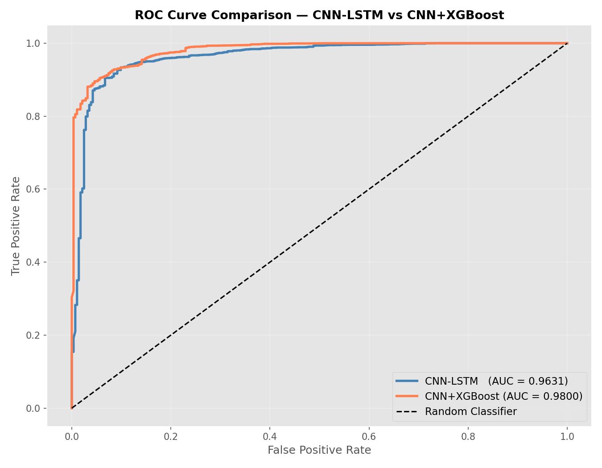
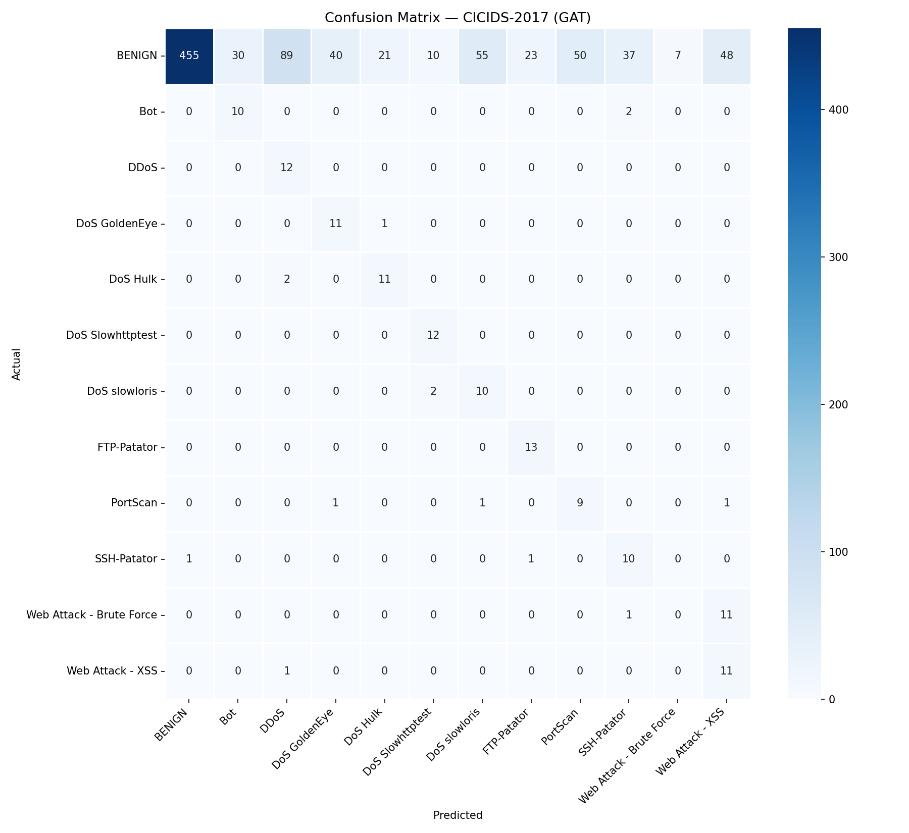

# Deep Learning Approaches for Cyber Attack Detection (FYP 1)

Final Year Project 1 | Bachelor of Information Technology (Honours), International Islamic University Malaysia (IIUM)
Individual research project. FYP 2 is in progress and will extend this work.

## What this project is about

Cyber attacks keep changing, and traditional detection tools struggle with new variants. This project studies two deep learning approaches from published research, rebuilds them so they run on real data, and tests whether changes can improve them.

- **Article 1: Malware detection.** A CNN-LSTM model that classifies malware from API call sequences, compared with a CNN-XGBoost version.
- **Article 2: Network intrusion detection.** A Graph Neural Network (GNN-IDS) that treats network traffic as a graph. I rebuilt it using a Graph Attention Network (GAT) and real traffic data.

## What I did

### 1. Malware detection (`article1-malware-cnn-lstm/`)
- Recreated the CNN-LSTM model from the original paper and ran it in Python (TensorFlow/Keras).
- Replaced the LSTM part with XGBoost to see if sequence memory is really needed.
- Trained both on 43,876 malware API call sequences and compared them.

| Model | Accuracy | ROC-AUC |
|---|---|---|
| CNN-LSTM | 94.09% | 0.963 |
| CNN-XGBoost | 98.59% | 0.980 |

### 2. Intrusion detection (`article2-gnn-ids/`)
The original public code only ran on synthetic (computer-generated) data. I reworked it to use real traffic:
- Swapped the GCN layer for a Graph Attention Network with 4 attention heads (PyTorch Geometric)
- Ran it on real CICIDS-2017 and CIC-IDS-2018 data (two daily files from 2018)
- Added feature selection, class weighting for imbalanced data, early stopping, gradient clipping, and a learning-rate schedule
- Added evaluation beyond accuracy: F1, ROC-AUC, per-class results, confusion matrices
- Added explainability: attention weights and feature importance charts

Highlights: ROC-AUC **0.976** on CICIDS-2017 and **99.10%** accuracy on the CIC-IDS-2018 (14 Feb) file.
Each folder in `results/` has the charts and a table comparing the original code with my version.

## Tools
Python, TensorFlow, Keras, PyTorch, PyTorch Geometric, scikit-learn, XGBoost, pandas, Matplotlib, Google Colab

## How to run
1. Open a notebook (`.ipynb`) in Google Colab.
2. Download the dataset from the links below and upload it to Colab.
3. Run the cells from top to bottom.

## Datasets (not included, too large)
- Malware API call sequences dataset (Kaggle)
- CICIDS-2017 and CIC-IDS-2018, Canadian Institute for Cybersecurity, University of New Brunswick

## Credits
- Article 1 is based on Akhtar and Feng (2022), a hybrid CNN-LSTM model for malware detection using API call sequences.
- Article 2 is based on Sun, Teixeira and Toor (2024), *GNN-IDS: Graph Neural Network-based Intrusion Detection System* (ARES 2024). I adapted the authors' public code.
- I used AI tools (Claude) for coding help and checked the code and results myself.

## Supervisor
Asst. Prof. Dr. Sharyar Wani, KICT, IIUM

## Status
FYP 1 completed. FYP 2 in progress.
